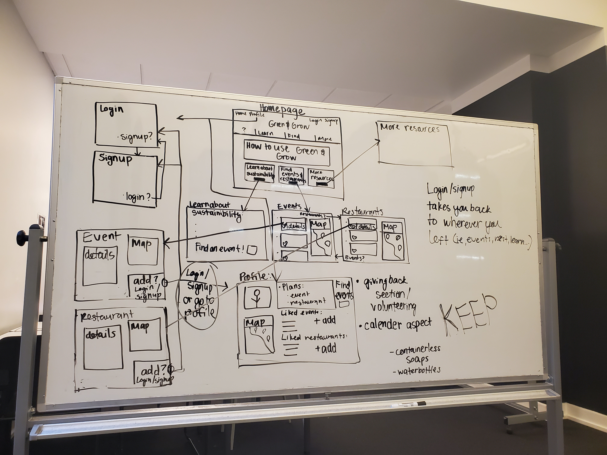

## Link:
https://green-and-grow.herokuapp.com/

# Green & Grow
### Description:
This application was inpired by my mother who has spent much of her free time researching and learning about how to make her life more sustainable and less wasteful. She has shared how difficult it is to find ways to improve her lifestyle without a platform that can assist in her research. Green & Grow is meant to bring the vast world of sustainable living information to one space. Someone can go to the site to simply learn more about the vocabulary and common practices of living greener, or go further to discover educational talks and events through the eventful api built into the app. If someone finds an event that interests them, they can like and follow the event, which will be saved to their profile. They can also plan a day by choosing an event and then being directed to choose a restaurant nearby that adheres to organic practices, uses local ingredients, or is farm-to-table. There is a section for further reading with additional resources to help with tips and tricks for a greener life, suggestions of local organizations that need volunteers, and community gardens that are accepting new members.

### Tools:
Green & Grow is built with HTML5, CSS, Javascript, Node.js, and RESTful routing practices
#### APIs:
- Eventful
- Zomato

### Future Goals for Green & Grow
- I would like to add a calendar feature to the app that would automatically fill "liked" and "planned" events and restaurants in order to follow them easier. I was also hoping to add a map feature to help in the plan decisions with engouragment to take public or no fuel transit but I ran out of time. I plan to add this in at a later date.
- I would also like to add the ability to purchase tickets directly from my site rather than sending the user to the event somewhere else to pay.
- I think this app could benefit from a social network aspect, where people could connect and become "friends" and plan events together as a group.
- Finally, I would like to add more features to really round out the app, making it the best place to find information about sustainability. Add a few more APIs to news outlets with running articles on whats new in green living. Incorporate a simulator for users to measure their greenhouse impact on the planet. And add a meetup component to help unite people and strangers outside of the app to encourage long term changes.

### Wireframes:

